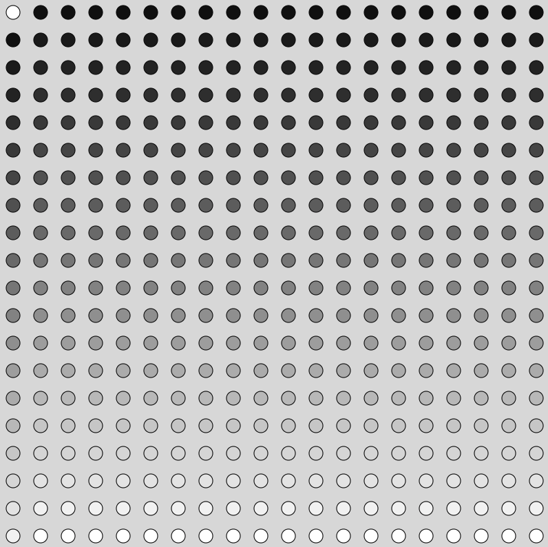

# For Loop / Nested For Loops Display Circle Grid P5.JS

- P5 nested for loops to build a grid
- each circle is plotted every 40 px
- each circle fill(n) value is changed each trip through the verticle (y-axis)loop showing a gradual change through the single monochrome fill(n) value

